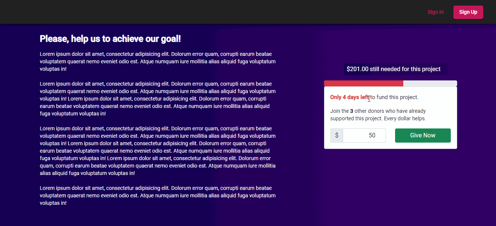
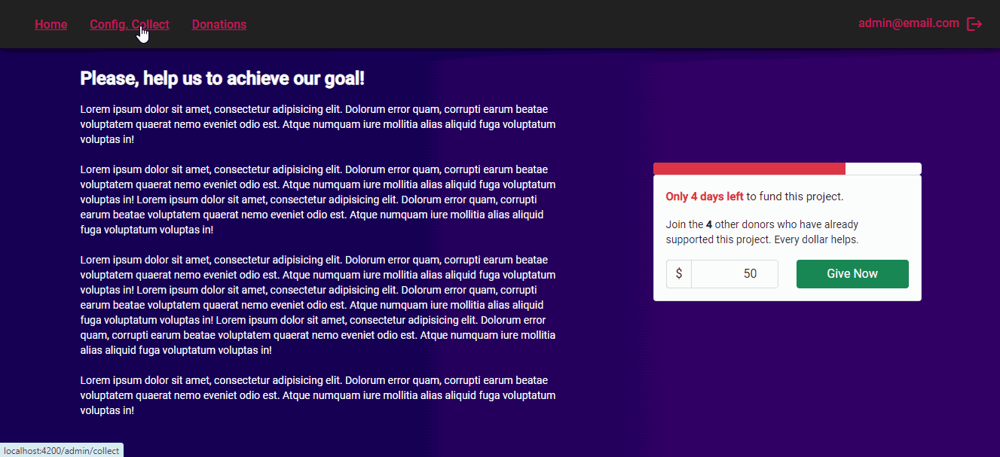

# Donations App Frontend

Proyecto desarrollado con [Angular CLI](https://github.com/angular/angular-cli) versión 13.0.4.

Se utilizó adicionalmente componentes del módulo [Angular Material](https://material.angular.io/), la hoja de estilos de [Bootstrap](https://getbootstrap.com/) y [ngx-toastr](https://www.npmjs.com/package/ngx-toastr) para las notificaciones.

## Restaurar Dependencias

Para restaurar las dependencias del proyecto abrir una terminal en la carpeta del proyecto y ejecutar `npm install`. Es necesario tener previamente instalado Node.js y npm. 
 
## Servidor de desarrollo

Para servir la app, desde una terminal en la carpeta del proyecto, ejecutar `ng serve` o `npm start`, una vez compilada se puede visualizar la app en `http://localhost:4200/`.

## Deployment

Se compiló el proyecto para producción ejecutando `ng build` y se publicó el contenido de la carpeta `dist/` en un servidor Nginx alojado en una EC2 Instance de AWS disponible en [http://ec2-18-233-166-199.compute-1.amazonaws.com](http://ec2-18-233-166-199.compute-1.amazonaws.com).

## Demo

La aplicación consiste en una single page para la realización de una colecta en la que para poder efectuar las donaciones un usuario debe estar previamente loggeado en el sistema. 

Si se ingresa con un usuario administrador se puede configurar los parámetros de la collecta como así también visualizar las donaciones realizadas ordenandolas por determinada columna o filtrando por usuario.

 
